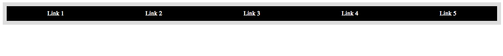

##Lesson 05 - Startup Matchmaker

###Pre-lesson

Install Hipchat!

###Learning Objectives

*	Practice web development by transforming a design comp into an HTML and CSS web page.

###Schedule


| Time        | Topic| GA ICLs| Comments |
| ------------- |:-------------|:-------------------|:----------------|
| 180 min | Lab Session | Startup Match Maker | Students build a site with little guidance on how to start. |


---

##Review

* 2 or 3 students present their fashion blogs
* Questions, common issues
	* Answer most common questions
	
<br><br><br>

##Review display

The `display` property can take 4 values:

* __inline__ (eg. a, span, strong, em)
* __block__ (eg. div, p, h1, article, nav)
* __inline-block__
* __none__


You can't apply width to inline elements, it doesn't do anything!

You also can't apply any vertical margins. (But left and right are allowed).

Inline-block exercise: [http://codepen.io/anon/pen/felqd?editors=110](http://codepen.io/anon/pen/felqd?editors=110)

Inline-block challenge (MAKE SURE TO FORK!): [http://codepen.io/anon/pen/hKIBx?editors=110](http://codepen.io/anon/pen/hKIBx?editors=110)

Make it look like this:


##Review floats and clearing

* Floated elements are pushed to the left or right side of their container.
* Other content flows around floats.
* To stop content from flowing around a floated element, we can add the `clear` CSS rule to the content (not the floated element).
* Use a `.clear` utility div, or add `.clearfix` to a container to stop reflow.

####Exercise

* Open [http://codepen.io/anon/pen/mtcsf?editors=110](http://codepen.io/anon/pen/mtcsf?editors=110)
* Float the image the left.
* Apply `clear: left;` to the paragraph in order to stop the flow.
* Implement a clearing div to universally clear any floating content.

Code-along float challenge (MAKE SURE TO FORK!): [http://codepen.io/anon/pen/cqpou?editors=110](http://codepen.io/anon/pen/cqpou?editors=110)

Make it look like this:




Review: [http://alistapart.com/article/css-floats-101](http://alistapart.com/article/css-floats-101)


##[Startup Matchmaker](starter_code)

###Time: 160 min

| | |
| ------------- |:-------------|
| __Topics__ | html, css, planning | 
| __Description__| Students work in groups to determine what needs to be done. They then code the website.  |   
|__Activity Type__|group / individual | 
 
 
####Instructional Design Notes

*	This is an ambitious site to build in week 3. The goal is to encourage students to divide and conquer. We want to teach them how to look at a png file determine the sections that are needed and then code. 

*	Ask groups to plan and determine where they should start. They should follow the same process you taught them. 

*	For the advanced students, there are 2 additional pages (developers & designers) they can code.

__Please note that students will need to Google:__

*	background-image
*	```<del>``` ```<ins>```
*	overflow

---
