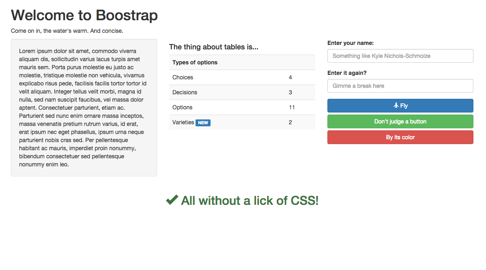

## Bootstrap! 

It's more than a buzzword

It's CSS Framework! (aka. a CSS file that makes a bunch of nice classes for you, and styles a bunch of stuff by default)

It's also got an optional javascript library.

How to install? CDN!

    <link rel="stylesheet" href="https://maxcdn.bootstrapcdn.com/bootstrap/3.3.1/css/bootstrap.min.css">
    
    
    
That was easy!

Get used to their documentation, let's head there: [getboostrap.com](getboostrap.com).

### Challenge: Create this page without any CSS!

